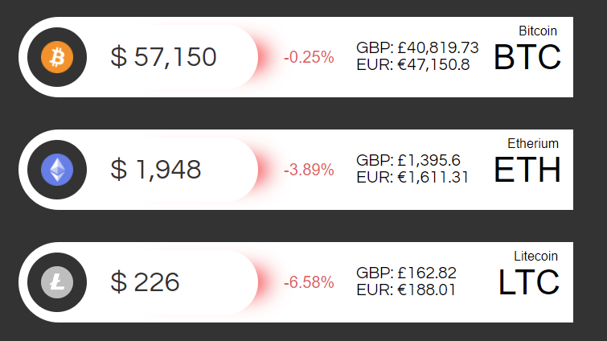

A Web Application to display Crypto data.

Built on the Python Flask web-framework. 

Usage

Create a virtual enviroment

python -m pip install flask

python -m pip install requests

python -m flask run
